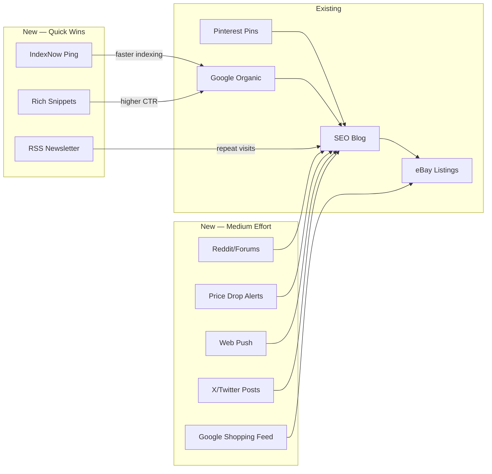

# 🚀 Additional Traffic Ideas for eBay Listings

> Ranked by **effort vs. impact**. All ideas are designed to be automated, hands-off, and compatible with your existing pipeline architecture.

## What You Already Have

| Channel | Status | Effort | Traffic Potential |
|---------|--------|--------|-------------------|
| SEO Blog (Hugo + GitHub Pages) | ✅ Live | Done | ⭐⭐⭐ (medium-term) |
| Pinterest Auto-Pinner | ✅ Built | Done | ⭐⭐ (slow build) |
| Google Indexing (sitemap.xml, RSS) | ✅ Configured | Done | ⭐⭐⭐ |

---

## New Ideas — Sorted by Ease of Implementation

### 1. 🔍 Google Search Console + `IndexNow` Ping (Effort: 1 hour)

**What**: Every time your pipeline publishes new posts, automatically ping Google and Bing to crawl them *immediately* instead of waiting days for organic discovery.

**Why it matters**: Your blog generates new pages daily but search engines may not discover them for days/weeks. IndexNow tells Bing, Yandex, and others instantly. Google's Indexing API does the same for Google.

**How it fits your pipeline**:

```
Hugo build → New post URLs collected → POST to IndexNow API + Google Indexing API
```

- **IndexNow**: Free, single HTTP POST per URL. Covers Bing, Yandex, DuckDuckGo, and others.
- **Google Indexing API**: Free, requires a Google Cloud service account (one-time setup).
- Add a `notify_search_engines()` step after `SiteBuilder.publish_batch()` in your pipeline.

**Impact**: ⭐⭐⭐⭐ — Pages indexed within hours rather than days. Directly increases organic search impressions.

---

### 2. 📧 RSS-to-Email Newsletter (Effort: 2 hours)

**What**: Use your existing RSS feed (`/feed.xml`) to auto-send a weekly digest email to subscribers. Zero manual work — services like Mailchimp, Buttondown, or Listmonk can consume an RSS feed and send digests on a schedule.

**Why it matters**: Repeat visitors are your cheapest traffic. An email list you own is immune to algorithm changes.

**How it fits your pipeline**:

```
Hugo builds RSS → Mailchimp/Buttondown auto-pulls feed → Weekly email digest sent
```

- **Buttondown** (free tier: 100 subscribers) has native RSS-to-email.
- Add a simple "Subscribe" form to your Hugo site's home template.
- No code changes to the pipeline — just configure the email service once.

**Impact**: ⭐⭐⭐ — Drives repeat traffic; compounds over time as subscriber list grows.

---

### 3. 📰 Auto-Post to Reddit / Niche Forums (Effort: 3–4 hours)

**What**: After generating a buyer's guide or deals post, automatically share it to relevant subreddits (e.g., r/DealsUK, r/UKBargains, r/VintageTech) or niche forums using their APIs.

**Why it matters**: Reddit posts can drive significant short-term traffic spikes, especially for deals content. Some subreddits allow deal/guide posts if they're genuinely useful (not spammy).

**How it fits your pipeline**:

```
New blog post → Map category to subreddit → Submit via Reddit API (PRAW)
```

- Use Python's `praw` library for Reddit API.
- Map your post categories (Beauty & Health, DIY, etc.) to relevant subreddits.
- Only share certain post types (buyer's guides, deals) — not every single listing post.
- Include a cooldown (max 1-2 posts per subreddit per day) to avoid spam flags.

**Impact**: ⭐⭐⭐ — Immediate traffic spikes. Risk: may need to curate which subreddits accept promotional content.

---

### 4. 🛒 Google Merchant Center Free Listings Feed (Effort: 4–5 hours)

**What**: Generate a Google-compatible product feed (XML/TSV) from your scraped eBay listings and submit it to Google Merchant Center. Your products appear in Google Shopping results *for free*.

**Why it matters**: Google Shopping is a massive purchase-intent channel. People searching there are ready to buy.

**How it fits your pipeline**:

```
eBay Scraper → listings.json → Feed Generator → Google Merchant Center feed (XML/TSV)
```

- New module: `feed_generator.py` — transforms `listings.json` into a Google Shopping feed.
- Required fields: `id`, `title`, `description`, `link`, `image_link`, `price`, `availability`, `condition`.
- Host the feed as a static file on your GitHub Pages site.
- Submit the feed URL to Google Merchant Center (one-time manual step).
- Feed auto-updates every time the pipeline runs.

**Impact**: ⭐⭐⭐⭐ — High purchase intent traffic. Free product impressions on Google.

---

### 5. 🔗 Schema.org Structured Data / Rich Snippets (Effort: 2–3 hours)

**What**: Add `Product` and `AggregateOffer` schema.org JSON-LD to each blog post so Google shows rich snippets (star ratings, price ranges, availability) in search results.

**Why it matters**: Rich snippets dramatically increase click-through rates (CTR). A search result showing "£5.99 – £19.99 • In Stock" gets more clicks than a plain text link.

**How it fits your pipeline**:

```
AIWriter generates post → SiteBuilder embeds JSON-LD in Hugo frontmatter/partial
```

- Add a Hugo partial template that outputs `<script type="application/ld+json">` with product data.
- Pull price, image, condition, and availability from the listing data already in your pipeline.
- No new modules needed — just a Hugo template change + frontmatter enrichment in `SiteBuilder`.

**Impact**: ⭐⭐⭐⭐ — Higher CTR on existing search impressions. Compounds with your existing SEO.

---

### 6. 📱 Web Push Notifications (Effort: 3–4 hours)

**What**: Add browser push notification support to your Hugo site. When a new deals post is published, subscribers get a push notification — even if their browser is closed.

**Why it matters**: Push notifications have much higher engagement rates than email. Good for time-sensitive deals content.

**How it fits your pipeline**:

```
New post published → Send push notification via OneSignal/Firebase Cloud Messaging
```

- Use a free service like **OneSignal** (free tier: unlimited subscribers on web push).
- Add the OneSignal JS snippet to your Hugo base template.
- Add a pipeline step to call OneSignal's REST API after publishing new posts.

**Impact**: ⭐⭐⭐ — Drives immediate return traffic for deals. Requires visitors to opt in first.

---

### 7. 🐦 Twitter/X Auto-Poster (Effort: 2–3 hours)

**What**: Auto-tweet each new blog post with a short summary, price hint, and link. X's search is increasingly indexed by Google, adding another discoverability layer.

**Why it matters**: Even without followers, X posts are indexed by search engines and appear in Google results. It's another free backlink + discovery surface.

**How it fits your pipeline**:

```
New blog post → Generate tweet text (title + price + link) → Post via X API v2
```

- Use the `tweepy` library for X API v2.
- Free tier allows 1,500 tweets/month (more than enough).
- Add hashtags based on category for discoverability.

**Impact**: ⭐⭐ — Low effort, moderate discoverability boost. Mainly useful as an additional backlink source.

---

### 8. 📊 Price Tracking / Deal Alert Pages (Effort: 5–6 hours)

**What**: Track your listing prices over time and generate "Price Drop Alert" blog posts when items reduce in price. People actively search for price drops.

**Why it matters**: "Price drop" and "deal alert" are high-intent search queries. This creates a new content type that targets bargain hunters specifically.

**How it fits your pipeline**:

```
Scraper runs daily → Compare prices to yesterday → Generate "Price Drop" posts for changed items
```

- Store a price history in `data/price_history.json`.
- New planner post type: `price_drop_alert`.
- Only generate a post when a meaningful price change is detected (e.g., >10% drop).

**Impact**: ⭐⭐⭐ — Targets high-intent "deal" searches. Adds freshness signals for SEO.

---

## Priority Recommendation

For maximum traffic with minimum effort, implement in this order:

| Priority | Idea | Time | Why First |
|----------|------|------|-----------|
| 1 | IndexNow / Google Indexing API | 1 hr | Your existing pages get found faster — amplifies everything else |
| 2 | Schema.org Rich Snippets | 2 hrs | Higher CTR on search results you already have |
| 3 | Google Merchant Center Feed | 4 hrs | Puts products directly in Google Shopping — highest purchase intent |
| 4 | RSS-to-Email Newsletter | 2 hrs | Builds owned audience; set-and-forget |
| 5 | Price Drop Alerts | 5 hrs | New high-intent content type; leverages existing scraper data |



---

## Information Requested

- **TBD**: Do you have a Google Search Console account set up and verified for your site? (Needed for idea #1 and #2.)
- **TBD**: Do you have a Google Merchant Center account? (Needed for idea #4 — free to create.)
- **TBD**: Any preference on email newsletter provider? (Buttondown is simplest; Mailchimp has more features.)
- **TBD**: Any subreddits or forums you already know are relevant to your product categories?

---

<small>Generated with GitHub Copilot as directed by c4duc3u5</small>
